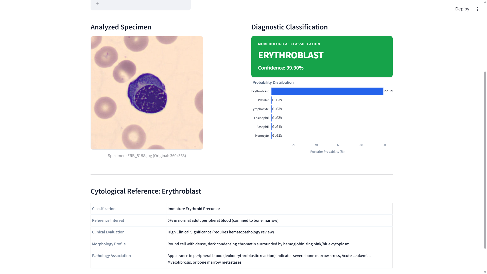

# 🩸 Blood Cell Classifier

An end-to-end Computer Vision & Deep Learning system for automated white blood cell classification from peripheral blood smears — built to assist hematopathologists in cytology differential workflows.

Blood cancers such as Acute Lymphoblastic Leukemia (ALL), Chronic Lymphocytic Leukemia (CLL), CML, and AML are diagnosed by identifying abnormal leukocyte lineages and immature precursor cells under high-magnification microscopy. This project automates that cell-identification workflow using a fine-tuned EfficientNetB3 model and an interactive clinical web app — flagging cell-type patterns associated with these conditions to support (not replace) pathologist review.

**Live Classification Demo**


## 🧬 Target Classes & Clinical Relevance

| Cell Lineage | Normal Range | Clinical Significance |
|---|---|---|
| Lymphocyte | 20–40% (1,000–4,000/µL) | ALL, CLL, Non-Hodgkin Lymphoma |
| Erythroblast (NRBC) | 0% in adult peripheral blood | Marrow stress/infiltration, AML-M6, myelofibrosis |
| Monocyte | 2–8% (200–800/µL) | CMML, AML-M4/M5 |
| Basophil | 0–1% (<100/µL) | CML hallmark (marked basophilia) |
| Eosinophil | 1–4% (50–500/µL) | Hypereosinophilic Syndrome, CEL |
| Platelet | 150k–450k/µL | Essential Thrombocythemia, MDS, thrombocytopenia |

## 📊 Dataset

- **Source**: Kaggle Peripheral Blood Cell Dataset
- **Total images**: 17,092
- **Format**: 224×224 px, 3-channel RGB (.jpg, .png)
- **Staining**: Romanowsky / Giemsa-Wright, 100× oil immersion
- **Splits**: Standardized Train / Validation / Holdout Test

## 🧠 Model Architecture

**Backbone**: EfficientNetB3, pre-trained on ImageNet

**Head**:
- GlobalMaxPooling2D
- Batch Normalization
- Dense(256, ReLU) with L1=0.016 / L2=0.032 weight decay
- Dropout (0.45)
- Dense(6, Softmax)

**Training**:
- Optimizer: Adamax
- Loss: Categorical Cross-Entropy
- Hardware: NVIDIA Tesla T4 (Google Colab)
- Model file: `Bloods.h5` (~48 MB)

## 📈 Benchmark Results

Evaluated on 870 independent holdout test samples:

| Metric | Score |
|---|---|
| Test Accuracy | 97.50% (848/870) |
| Training Accuracy | 97.92% |
| Validation Accuracy | 96.67% |
| Test Cross-Entropy Loss | 0.648 |
| Macro Avg F1-Score | 96.50% |

**Per-class breakdown**:
| Class | Precision | Recall | F1-Score |
|---|---|---|---|
| Platelet | 100% | 100% | 100% |
| Eosinophil | 97% | 99% | 98% |
| Basophil | 97% | 94% | 96% |
| Monocyte | 95% | 98% | 97% |
| Lymphocyte | 96% | 93% | 94% |
| Erythroblast | 95% | 93% | 94% |

## 💻 Web Application Features

- **Autonomous Multi-View Isolation** — scans full field + left/right focal crops + center region to isolate the key diagnostic cell automatically
- **Uncropped Natural Display** — shows specimens in native 370×370px proportions
- **Calibrated Prediction Banner** — high-confidence matches (≥80%) shown in clinical green
- **Real-Time Probability Chart** — Plotly horizontal distribution across all 6 classes
- **Reference Tabs** — model convergence curves, confusion matrix, dataset specifications

## 🛠️ Tech Stack

Python 3.10+ · TensorFlow/Keras · Streamlit · NumPy · Pandas · Pillow · Plotly Express

## ⚠️ Disclaimer

This is a research and educational tool for automated blood cell-type classification. It is **not a standalone diagnostic device** and does not replace pathologist evaluation or formal clinical diagnosis.

## 🚀 Run Locally

```bash
git clone https://github.com/shivamraut747-ux/Blood-Cell-Classifier.git
cd Blood-Cell-Classifier
pip install -r requirements.txt
streamlit run app.py
```
